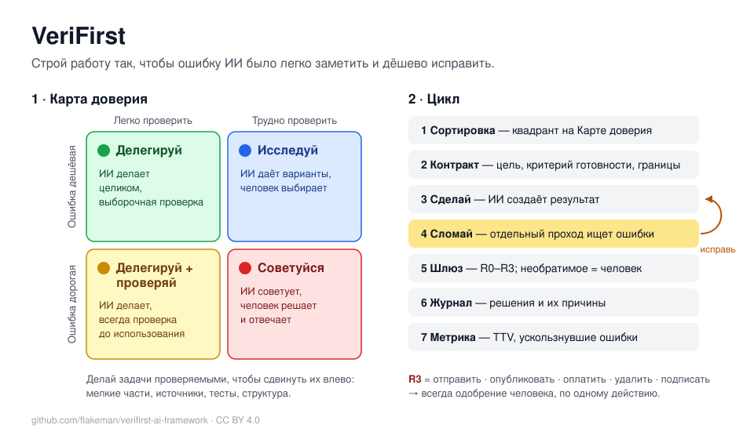

# VeriFirst за 5 минут

[English version](CHEATSHEET.md) · [Полный фреймворк](README.ru.md)

**Одно правило:** строй работу так, чтобы ошибку ИИ было легко заметить и дёшево исправить.

## Перед задачей — 2 вопроса

1. **Чего стоит незамеченная ошибка?** Мало / Много
2. **Как быстро это проверить?** Легко / Трудно

| | Легко проверить | Трудно проверить |
|---|---|---|
| **Ошибка дешёвая** | 🟢 **Делегируй** — ИИ делает, выборочная проверка | 🔵 **Исследуй** — ИИ даёт варианты, выбираешь ты |
| **Ошибка дорогая** | 🟡 **Делегируй + проверяй** — всегда проверка до использования | 🔴 **Советуйся** — ИИ советует, решаешь ты |

Трудно проверить? Разбей на части, требуй источники, заранее подготовь тесты или эталонные примеры.

## Постановка задачи — 6 строк

**Цель** · **Критерий готовности** (проверки «да/нет») · **Границы** (что нельзя менять и выдумывать) · **Входные данные** · **Проверяющий** · **Формат результата**.
Нет критерия готовности → задача не готова к делегированию.

## Проверка результата — в отдельной сессии или другим человеком

☐ Критерии готовности выполнены ☐ Ничего не выдумано (факты, источники, цифры, API) ☐ Логика и арифметика ☐ Граничные случаи ☐ Нет изменений, о которых не просили ☐ Нет ложной уверенности

Не больше 3 кругов «Сделай — Сломай». Всё ещё плохо → переписывай задачу, а не результат.

## Перед действием

| R0 чтение | R1 локально, обратимо | R2 обратимо с усилием | R3 необратимо |
|---|---|---|---|
| свободно | свободно | сначала бэкап или одобрение | **всегда человек**, по одному действию |

## Запоминай и измеряй

- **Журнал решений:** решение · причина · отвергнутые варианты · когда пересмотреть. Подавай его ИИ обратно.
- **TTV** — время до проверенного результата, а не до созданного. Считай **ускользнувшие ошибки**.

## Начни завтра

1. Называй квадрант перед каждой нетривиальной задачей для ИИ.
2. Записывай критерий готовности в одну-две строки.
3. Не принимай 🟡 и 🔴 результат без отдельного прохода «Сломай».

Чтобы ИИ сам следовал этим правилам: [инструкции для ИИ](ai-instructions/README.md).
