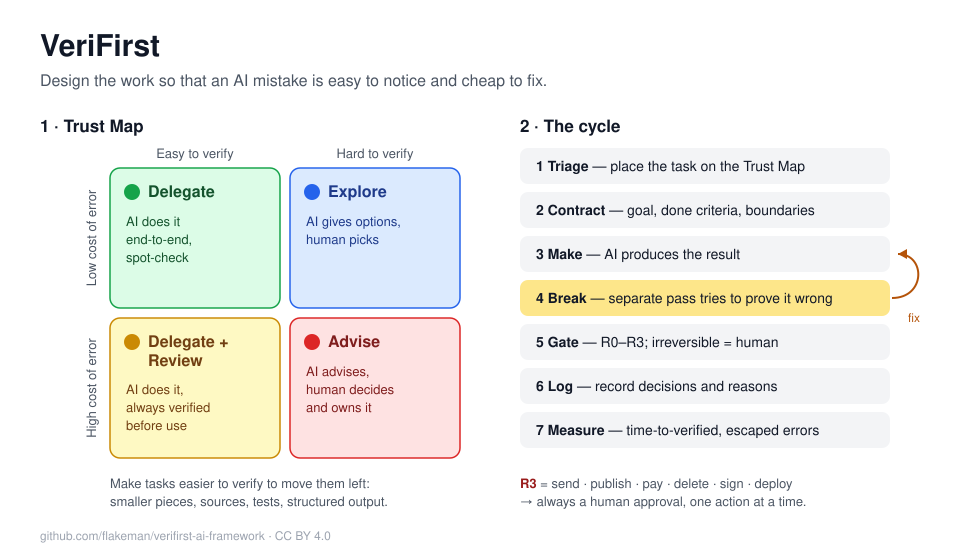
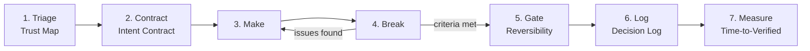

# VeriFirst

**A verification-first framework for working with AI**

**Author:** Vladimir Kulanov (Владимир Куланов)

[Русская версия](README.ru.md)

---

## Why another framework?

Most classic frameworks for analysis and delivery (Waterfall, Scrum, SWOT, RACI, etc.) were built for a world where **producing is expensive and checking is cheap**. A developer spends a day writing a feature; a reviewer spends an hour reading it.

AI inverts this. A draft takes seconds, while making sure it is correct can take longer than writing it yourself. Output is no longer the bottleneck. **Trust is.**

VeriFirst is built around one rule:

> **Design the work so that an AI mistake is easy to notice and cheap to fix.**

Everything else follows from it.

---



## Start here

| If you want to… | Open |
|---|---|
| Get the idea in 5 minutes | [Cheat sheet](CHEATSHEET.md) |
| Make your AI assistant follow VeriFirst automatically | [AI instructions](ai-instructions/README.md) — Claude, ChatGPT, Claude Code, Cursor, Copilot |
| Put it into your team's GitHub or Jira | [Integrations](integrations/README.md) — issue form, PR template, Jira setup |
| Use it inside Scrum, Kanban or Waterfall | [Integration guide](docs/en/integration.md) |
| Roll it out across several teams or a company | [Scaling guide](docs/en/scaling.md) |

---

## Principles

| # | Principle | What it means in practice |
|---|-----------|---------------------------|
| P1 | **Verification is the bottleneck** | Plan around how a result will be checked, not how it will be produced. |
| P2 | **Gaps get filled — explicitly or by the AI** | Anything you leave unsaid, the model will confidently invent. State intent, limits and "done" up front. |
| P3 | **Separate making from judging** | The same pass that created a result should not be the one that approves it. |
| P4 | **Memory lives outside the model** | Decisions, reasons and context are written down and fed back in, not assumed to persist. |
| P5 | **Autonomy scales with reversibility** | The cheaper an action is to undo, the more freedom the AI gets. Irreversible actions always go through a human. |
| P6 | **Measure trusted output, not output** | Volume is free. What counts is how fast you get a result you can rely on. |

---

## The workflow



1. **Triage** the task on the Trust Map to choose a working mode.
2. **Contract** — write a short Intent Contract.
3. **Make** — the AI produces a result.
4. **Break** — a separate pass tries to prove the result wrong.
5. **Gate** — apply the reversibility level before anything leaves the sandbox.
6. **Log** — record decisions that future work depends on.
7. **Measure** — track Time-to-Verified and escaped errors.

Small tasks can run this in a minute in your head. Large ones use the templates in [`templates/en`](templates/en).

---

## 1. Trust Map — task triage

Place every task on two axes:

- **Cost of error** — what happens if the result is wrong and nobody notices?
- **Ease of verification** — how quickly and reliably can a human (or a test) confirm it is right?

|  | **Easy to verify** | **Hard to verify** |
|---|---|---|
| **Low cost of error** | 🟢 **Delegate** — the AI does it end-to-end. Spot-check occasionally. | 🔵 **Explore** — the AI generates options; a human picks. Treat output as raw material. |
| **High cost of error** | 🟡 **Delegate + Review** — the AI does it; a human or automated check always verifies before use. | 🔴 **Advise** — the AI is a consultant only. It explains, lists risks, drafts questions. A human decides and owns the result. |

Examples:

- 🟢 Reformatting a table, drafting a routine email, renaming variables.
- 🟡 Code covered by tests, financial calculations with a reference total, data transformations with row counts.
- 🔵 Brainstorming names, alternative headlines, first ideas for a strategy.
- 🔴 Legal conclusions, medical decisions, irreversible business commitments, anything where errors surface months later.

### Moving a task to a better quadrant

The most valuable move is not choosing the quadrant — it is **changing it**. Make a task easier to verify by:

- splitting it into small pieces that can each be checked;
- requiring sources, references or quotes for every factual claim;
- writing tests, control totals or expected examples *before* the AI starts;
- asking for output in a structured format that can be diffed or validated automatically.

A 🔴 task can often become 🟡 this way. A 🔴 task that cannot be moved stays in Advise mode.

---

## 2. Intent Contract — instead of a spec

A traditional spec says *what to build*. An Intent Contract also says *what not to invent* and *how the result will be judged*. Six fields:

| Field | Question it answers |
|---|---|
| **Goal** | Why is this needed? What problem does it solve for whom? |
| **Done criteria** | How will I know it is finished and correct? (Observable, checkable.) |
| **Boundaries** | What must not be changed, assumed, or made up? |
| **Inputs & context** | What material, constraints and prior decisions does the AI need? |
| **Verifier & method** | Who or what checks the result, and how? |
| **Output format** | In what shape should the result come back? |

**Readiness rule:** if you cannot write the *Done criteria*, the task is not ready to be delegated. Clarify it first — possibly with the AI's help in Advise mode.

Template: [`templates/en/intent-contract.md`](templates/en/intent-contract.md)

---

## 3. Make–Break Loop

Generation and critique are separate passes.

1. **Make** — the AI produces a result against the Intent Contract.
2. **Break** — a *separate* pass (new session, different role, another model, or a human) actively tries to prove the result wrong.
3. **Fix** — issues found go back to Make.
4. **Stop** when the Done criteria are met *and* the Break pass finds nothing material — or when an iteration limit is reached (default: 3). Hitting the limit is a signal to rethink the contract, not to keep looping.

Why separate? A model reviewing its own work in the same context tends to defend it. A fresh context with an adversarial goal finds far more.

What the Break pass looks for:

- **Fabrication** — invented facts, sources, APIs, numbers, names.
- **Contract breach** — anything outside the Boundaries, or a missed Done criterion.
- **Logic** — contradictions, unjustified leaps, wrong arithmetic.
- **Edge cases** — empty inputs, extremes, unusual but realistic scenarios.
- **Scope creep** — changes nobody asked for.
- **Overconfidence** — claims stated as certain that should be hedged.

Checklist and prompt snippets: [`templates/en/break-review.md`](templates/en/break-review.md)

---

## 4. Decision Log — external memory

AI does not remember *why* a decision was made, and people forget fast. Keep a short log:

| Field | Content |
|---|---|
| **ID / date** | `D-007 · 2026-10-08` |
| **Decision** | One sentence. |
| **Reason** | Why this, in one or two sentences. |
| **Rejected alternatives** | What was considered and why it lost. |
| **Revisit if** | The condition that would reopen this decision. |

Rules:

- Log decisions that **future work depends on**, not every step.
- Feed the relevant part of the log into the AI's context whenever you return to the project.
- When the AI proposes something that contradicts the log, it must say so explicitly.

Template: [`templates/en/decision-log.md`](templates/en/decision-log.md)

---

## 5. Reversibility Gates

Every action the AI can take has a reversibility level. Autonomy is granted per level, never in bulk.

| Level | Description | Examples | Default autonomy |
|---|---|---|---|
| **R0** | Read-only | Reading files, searching, analysing | Free |
| **R1** | Reversible, local | Drafts, new files, a git branch, a sandbox | Free; result reviewed per Trust Map |
| **R2** | Reversible with effort | Editing shared documents, changing configs, bulk edits | Requires a checkpoint/backup first, or explicit approval |
| **R3** | Irreversible | Sending, publishing, paying, deleting, signing, deploying to production | **Always a human gate.** One approval covers one action. |

Raise autonomy by making actions cheaper to undo (version control, backups, staging, drafts), not by trusting more.

---

## 6. Time-to-Verified (TTV)

The primary metric:

> **TTV** = time from stating the task to the moment the result is **verified and trusted enough to use**.

Supporting metrics:

- **Rework rate** — share of tasks that needed more than one Make–Break iteration.
- **Escape rate** — errors found *after* a result was accepted. This is the one to drive toward zero for 🟡 and 🔴 tasks.
- **Verification share** — share of TTV spent on checking. If it is high, invest in making tasks easier to verify (see Trust Map).

What this metric deliberately ignores: pages, lines of code, number of drafts. An AI that produced 40 pages in a minute that took three days to check has a TTV of three days.

---

## Integration and scaling

- [Integrating with Agile and Waterfall](docs/en/integration.md) — Scrum, Kanban, V-model, hybrids, with worked examples.
- [Scaling: from one team to the whole company](docs/en/scaling.md) — team of teams (SAFe-style) and portfolio level, with examples.

---

## Anti-patterns

| Anti-pattern | Why it hurts | VeriFirst fix |
|---|---|---|
| **"Looks right" acceptance** | Fluent text is not correct text. | Done criteria + Break pass. |
| **Self-review in the same chat** | The model defends its own output. | Separate Break context. |
| **Prompt as wish** | Gaps get filled with plausible inventions. | Intent Contract with Boundaries. |
| **Context amnesia** | Each session re-litigates old decisions. | Decision Log fed back in. |
| **All-or-nothing autonomy** | One bad irreversible action outweighs a hundred good ones. | Reversibility levels R0–R3. |
| **Volume as success** | Output is free; trust is not. | Measure TTV and escape rate. |
| **Endless loop** | Iterating instead of fixing a bad task definition. | Iteration limit → revisit the contract. |

---

## Adopting VeriFirst

**Individual (start today)**
1. Before each non-trivial AI task, name its Trust Map quadrant.
2. Write Done criteria in one or two lines.
3. Never accept 🟡 or 🔴 output without a Break pass.

**Team**
1. Use the Intent Contract template for any delegated AI task.
2. Keep one Decision Log per project, in the repo.
3. Agree on which actions are R2 and R3 for your systems; enforce human gates for R3.
4. Track TTV and escape rate for a month; move high-verification-cost tasks to better quadrants.

**Roles (optional for teams)**
- **Owner** — writes the Intent Contract, accepts the result.
- **Verifier** — runs or designs the Break pass. Must not be the same session that made the result; ideally a different person for 🔴 tasks.

---

## Repository structure

```
.
├── README.md                     # Framework (English)
├── LICENSE                       # CC BY 4.0
├── README.ru.md                  # Framework (Russian)
├── CHEATSHEET.md / .ru.md        # One-page summary
├── assets/                       # Diagrams (EN, RU)
├── ai-instructions/              # Prompts and rule files for AI tools
├── integrations/                 # GitHub issue/PR templates, Jira setup
├── docs/
│   ├── en/                       # Integration & scaling (English)
│   └── ru/                       # Integration & scaling (Russian)
└── templates/
    ├── en/
    │   ├── task-triage.md        # Trust Map worksheet
    │   ├── intent-contract.md    # Intent Contract
    │   ├── break-review.md       # Break pass checklist + prompts
    │   └── decision-log.md       # Decision Log
    └── ru/
        ├── task-triage.md
        ├── intent-contract.md
        ├── break-review.md
        └── decision-log.md
```

---

## Contributing

Ideas, examples from real projects and translations are welcome — open an issue or a pull request.

---

## License

[CC BY 4.0](LICENSE) © 2026 Vladimir Kulanov. You may share and adapt this work for any purpose, including commercially, with attribution.
