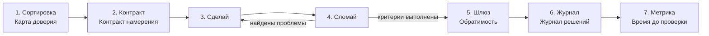

# VeriFirst

**Фреймворк для работы с ИИ, построенный вокруг проверки**

**Автор:** Владимир Куланов (Vladimir Kulanov)

[English version](README.md)

---

## Зачем ещё один фреймворк?

Большинство классических фреймворков анализа и разработки (Waterfall, Scrum, SWOT, RACI и др.) создавались для мира, где **делать дорого, а проверять дёшево**. Разработчик пишет фичу день, ревьюер читает её час.

ИИ переворачивает это. Черновик появляется за секунды, а убедиться в его правильности бывает дольше, чем написать самому. Узкое место теперь не производство результата, а **доверие к нему**.

VeriFirst построен вокруг одного правила:

> **Проектируй работу так, чтобы ошибку ИИ было легко заметить и дёшево исправить.**

Всё остальное следует из него.

---

## Принципы

| # | Принцип | Что это значит на практике |
|---|---------|----------------------------|
| P1 | **Проверка — узкое место** | Планируй, как результат будет проверен, а не как он будет создан. |
| P2 | **Пробелы заполнятся — тобой или ИИ** | Всё, что не сказано, модель уверенно додумает. Цель, границы и критерий готовности — заранее. |
| P3 | **Делать и оценивать — раздельно** | Тот же проход, что создал результат, не должен его принимать. |
| P4 | **Память живёт вне модели** | Решения, причины и контекст записываются и подаются обратно, а не считаются «запомненными». |
| P5 | **Автономия растёт вместе с обратимостью** | Чем дешевле откатить действие, тем больше свободы у ИИ. Необратимое — всегда через человека. |
| P6 | **Измеряй проверенный результат, а не объём** | Объём бесплатен. Важно, как быстро получен результат, которому можно доверять. |

---

## Рабочий цикл



1. **Сортировка** — помести задачу на Карту доверия и выбери режим работы.
2. **Контракт** — напиши короткий Контракт намерения.
3. **Сделай** — ИИ создаёт результат.
4. **Сломай** — отдельный проход пытается доказать, что результат неверен.
5. **Шлюз** — примени уровень обратимости, прежде чем что-то выйдет из «песочницы».
6. **Журнал** — зафиксируй решения, от которых зависит дальнейшая работа.
7. **Метрика** — отслеживай «время до проверенного результата» и ускользнувшие ошибки.

Мелкую задачу можно провести через цикл за минуту в голове. Для крупных — шаблоны в [`templates/ru`](templates/ru).

---

## 1. Карта доверия — сортировка задач

Каждую задачу оцениваем по двум осям:

- **Цена ошибки** — что будет, если результат неверен и этого никто не заметит?
- **Лёгкость проверки** — насколько быстро и надёжно человек (или тест) может подтвердить правильность?

|  | **Легко проверить** | **Трудно проверить** |
|---|---|---|
| **Ошибка дешёвая** | 🟢 **Делегируй** — ИИ делает задачу целиком. Выборочная проверка. | 🔵 **Исследуй** — ИИ генерирует варианты, человек выбирает. Результат — сырьё, а не готовый продукт. |
| **Ошибка дорогая** | 🟡 **Делегируй + проверяй** — ИИ делает, человек или автоматическая проверка всегда сверяет перед использованием. | 🔴 **Советуйся** — ИИ только консультант: объясняет, перечисляет риски, формулирует вопросы. Решает и отвечает человек. |

Примеры:

- 🟢 Переформатировать таблицу, черновик рутинного письма, переименовать переменные.
- 🟡 Код, покрытый тестами; финансовые расчёты с контрольной суммой; преобразование данных со сверкой количества строк.
- 🔵 Мозговой штурм названий, варианты заголовков, первые идеи для стратегии.
- 🔴 Юридические выводы, медицинские решения, необратимые деловые обязательства, всё, где ошибка всплывёт через месяцы.

### Как перевести задачу в лучший квадрант

Самое ценное — не выбрать квадрант, а **сменить его**. Задачу можно сделать проверяемой:

- разбить на мелкие части, каждую из которых легко проверить;
- требовать источник, ссылку или цитату для каждого фактического утверждения;
- написать тесты, контрольные суммы или эталонные примеры *до* начала работы ИИ;
- запросить результат в структурированном формате, который можно сравнить или проверить автоматически.

Так 🔴 задача часто становится 🟡. Если перевести не удаётся — она остаётся в режиме «Советуйся».

---

## 2. Контракт намерения — вместо ТЗ

Классическое ТЗ говорит, *что сделать*. Контракт намерения дополнительно говорит, *чего нельзя придумывать* и *как будет оцениваться результат*. Шесть полей:

| Поле | На какой вопрос отвечает |
|---|---|
| **Цель** | Зачем это нужно? Какую проблему и для кого решает? |
| **Критерий готовности** | Как я пойму, что сделано и сделано верно? (Наблюдаемо, проверяемо.) |
| **Границы** | Что нельзя менять, предполагать или выдумывать? |
| **Входные данные и контекст** | Какие материалы, ограничения и прошлые решения нужны ИИ? |
| **Проверяющий и способ** | Кто или что проверяет результат и как? |
| **Формат результата** | В каком виде вернуть результат? |

**Правило готовности:** если не получается сформулировать *Критерий готовности*, задача не готова к делегированию. Сначала её нужно прояснить — возможно, с помощью ИИ в режиме «Советуйся».

Шаблон: [`templates/ru/intent-contract.md`](templates/ru/intent-contract.md)

---

## 3. Цикл «Сделай — Сломай»

Создание и критика — отдельные проходы.

1. **Сделай** — ИИ создаёт результат по Контракту намерения.
2. **Сломай** — *отдельный* проход (новая сессия, другая роль, другая модель или человек) целенаправленно пытается доказать, что результат неверен.
3. **Исправь** — найденные проблемы возвращаются в «Сделай».
4. **Стоп**, когда критерии готовности выполнены *и* проход «Сломай» не находит существенного — или когда достигнут лимит итераций (по умолчанию 3). Упёрлись в лимит — значит, надо пересмотреть контракт, а не крутить цикл дальше.

Почему раздельно? Модель, оценивающая свою работу в том же контексте, склонна её защищать. Свежий контекст с задачей «найди ошибки» находит гораздо больше.

Что ищет проход «Сломай»:

- **Выдумки** — несуществующие факты, источники, API, цифры, имена.
- **Нарушение контракта** — выход за Границы или невыполненный критерий готовности.
- **Логика** — противоречия, необоснованные скачки, ошибки в арифметике.
- **Граничные случаи** — пустые входные данные, крайние значения, необычные, но реальные сценарии.
- **Расползание задачи** — изменения, о которых не просили.
- **Излишняя уверенность** — утверждения, поданные как факт там, где нужна оговорка.

Чек-лист и готовые промпты: [`templates/ru/break-review.md`](templates/ru/break-review.md)

---

## 4. Журнал решений — внешняя память

ИИ не помнит, *почему* было принято решение, а люди быстро забывают. Ведём короткий журнал:

| Поле | Содержание |
|---|---|
| **ID / дата** | `D-007 · 2026-10-08` |
| **Решение** | Одно предложение. |
| **Причина** | Почему именно так, одно-два предложения. |
| **Отвергнутые варианты** | Что рассматривали и почему отказались. |
| **Пересмотреть, если** | Условие, при котором решение стоит открыть заново. |

Правила:

- Записываем решения, **от которых зависит дальнейшая работа**, а не каждый шаг.
- Подаём нужную часть журнала в контекст ИИ при каждом возвращении к проекту.
- Если ИИ предлагает что-то, противоречащее журналу, он обязан сказать об этом явно.

Шаблон: [`templates/ru/decision-log.md`](templates/ru/decision-log.md)

---

## 5. Шлюзы обратимости

У каждого действия ИИ есть уровень обратимости. Автономия выдаётся по уровням, а не оптом.

| Уровень | Описание | Примеры | Автономия по умолчанию |
|---|---|---|---|
| **R0** | Только чтение | Чтение файлов, поиск, анализ | Свободно |
| **R1** | Обратимо, локально | Черновики, новые файлы, ветка в git, песочница | Свободно; результат проверяется по Карте доверия |
| **R2** | Обратимо с усилием | Правка общих документов, изменение конфигов, массовые правки | Сначала контрольная точка/бэкап или явное одобрение |
| **R3** | Необратимо | Отправить, опубликовать, оплатить, удалить, подписать, выкатить в прод | **Всегда через человека.** Одно одобрение — одно действие. |

Повышай автономию, делая действия дешевле для отката (контроль версий, бэкапы, стейджинг, черновики), а не просто больше доверяя.

---

## 6. Время до проверенного результата (TTV)

Основная метрика:

> **TTV (Time-to-Verified)** = время от постановки задачи до момента, когда результат **проверен и ему можно доверять настолько, чтобы использовать**.

Вспомогательные метрики:

- **Доля переделок** — сколько задач потребовало больше одной итерации «Сделай — Сломай».
- **Доля ускользнувших ошибок** — ошибки, найденные *после* принятия результата. Для 🟡 и 🔴 задач её нужно гнать к нулю.
- **Доля проверки** — какая часть TTV ушла на проверку. Если большая — вкладывайся в проверяемость задач (см. Карту доверия).

Что метрика сознательно игнорирует: страницы, строки кода, число черновиков. Если ИИ за минуту выдал 40 страниц, а проверяли их три дня, TTV — три дня.

---

## Интеграция и масштабирование

- [Интеграция с Agile и Waterfall](docs/ru/integration.md) — Scrum, Kanban, V-модель, гибриды, с разобранными примерами.
- [Масштабирование: от команды до компании](docs/ru/scaling.md) — несколько команд (по аналогии с SAFe) и уровень портфеля, с примерами.

---

## Антипаттерны

| Антипаттерн | Чем вредит | Решение в VeriFirst |
|---|---|---|
| **«Вроде нормально»** | Гладкий текст ≠ верный текст. | Критерий готовности + проход «Сломай». |
| **Самопроверка в том же чате** | Модель защищает свой результат. | Отдельный контекст для «Сломай». |
| **Промпт как пожелание** | Пробелы заполняются правдоподобными выдумками. | Контракт намерения с Границами. |
| **Амнезия контекста** | Каждая сессия заново спорит о старых решениях. | Журнал решений в контексте. |
| **Автономия «всё или ничего»** | Одно плохое необратимое действие перевешивает сотню хороших. | Уровни обратимости R0–R3. |
| **Объём как успех** | Выдача бесплатна, доверие — нет. | Метрики TTV и ускользнувших ошибок. |
| **Бесконечный цикл** | Итерации вместо исправления плохой постановки. | Лимит итераций → пересмотр контракта. |

---

## Как внедрять

**Лично (можно начать сегодня)**
1. Перед каждой нетривиальной задачей для ИИ назови её квадрант на Карте доверия.
2. Запиши критерий готовности в одну-две строки.
3. Никогда не принимай результат 🟡 или 🔴 без прохода «Сломай».

**В команде**
1. Используйте шаблон Контракта намерения для любой делегированной ИИ задачи.
2. Ведите один Журнал решений на проект, прямо в репозитории.
3. Договоритесь, какие действия в ваших системах относятся к R2 и R3; для R3 — обязательный человеческий шлюз.
4. Месяц отслеживайте TTV и ускользнувшие ошибки; переводите дорогие в проверке задачи в лучшие квадранты.

**Роли (опционально для команд)**
- **Владелец** — пишет Контракт намерения и принимает результат.
- **Проверяющий** — проводит или проектирует проход «Сломай». Не может быть той же сессией, что создала результат; для 🔴 задач — желательно другой человек.

---

## Структура репозитория

```
.
├── README.md                     # Фреймворк (английский)
├── LICENSE                       # CC BY 4.0
├── README.ru.md                  # Фреймворк (русский)
├── docs/
│   ├── en/                       # Интеграция и масштабирование (EN)
│   └── ru/                       # Интеграция и масштабирование (RU)
└── templates/
    ├── en/
    │   ├── task-triage.md        # Лист сортировки по Карте доверия
    │   ├── intent-contract.md    # Контракт намерения
    │   ├── break-review.md       # Чек-лист и промпты для «Сломай»
    │   └── decision-log.md       # Журнал решений
    └── ru/
        ├── task-triage.md
        ├── intent-contract.md
        ├── break-review.md
        └── decision-log.md
```

---

## Участие

Идеи, примеры из реальных проектов и переводы приветствуются — открывайте issue или pull request.

---

## Лицензия

[CC BY 4.0](LICENSE) © 2026 Владимир Куланов. Можно свободно распространять и адаптировать материал для любых целей, включая коммерческие, с указанием автора.
